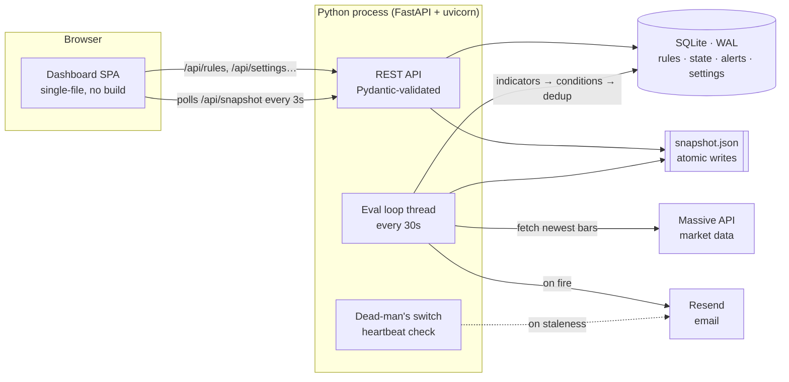
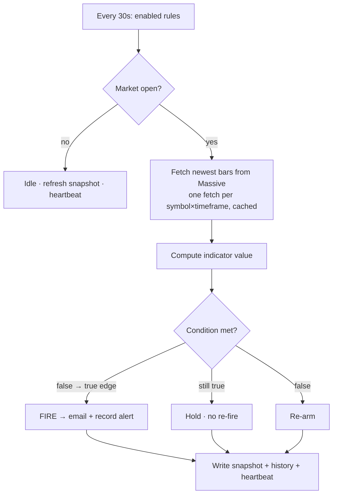

<div align="center">

# 📡 Alert Radar

### A customizable, real-time market-alert engine for stocks & ETFs — with a live dashboard and instant email delivery.


Define your own rules — *"email me when NVDA's 5-minute RSI drops below 15"* — and Alert Radar watches the market and notifies you the moment a condition fires. No spam, no polling by hand, no spreadsheets.

</div>

---

## Table of contents

- [Why I built this](#why-i-built-this)
- [Screenshots](#screenshots)
- [Features](#features)
- [Architecture](#architecture)
- [How an alert fires](#how-an-alert-fires)
- [Engineering highlights](#engineering-highlights)
- [Tech stack](#tech-stack)
- [Getting started](#getting-started)
- [Configuration](#configuration)
- [API reference](#api-reference)
- [Testing](#testing)
- [Deployment](#deployment)
- [Project structure](#project-structure)
- [Roadmap](#roadmap)
- [License](#license)

---

## Why I built this

Retail traders juggle a dozen browser tabs watching indicators that only matter for a few seconds a day. Commercial alerting tools are either rigid (fixed indicators) or locked behind subscriptions. I wanted a **self-hostable, fully customizable** alerting engine where the *condition types themselves are extensible* — closer to how Robinhood's alerts feel, but where I own the rules, the data source, and the delivery.

The result is a single Python process that runs a monitoring loop, persists everything to SQLite, and serves a polished single-page dashboard — plus a from-scratch technical-indicator library, an extensible condition registry, a transition-based de-duplication state machine, and a dead-man's switch that emails me if the monitor itself goes down.

## Screenshots

<div align="center">

**Dashboard** — live rule status, triggered-now counts, and a real-time alert feed


**Watchlist** — price + RSI across every symbol × timeframe at a glance


**Backtest** — replay any condition over recent bars to see how often it would have fired


**Settings** — editable recipients, delivery status, and data-source config


</div>

## Features

- **Customizable, extensible rules** — RSI, RSI band (fires on either bound), price levels, percent change, and moving-average crosses. New condition types are a ~15-line class away thanks to a decorator-based registry.
- **Instant email delivery** via [Resend](https://resend.com) — clean HTML alerts sent from your own verified domain.
- **Live dashboard** — create / edit / pause / delete rules, watch live indicator values, and see a *"triggered X ago"* counter tick in real time on every alert.
- **Watchlist** — live price and RSI for every watched symbol across all timeframes, color-coded oversold/overbought.
- **Backtesting** — replay any condition over the recent lookback window and get fire count, fire rate, and the exact bars where it triggered.
- **Dead-man's switch** — if the evaluation loop stops completing healthy cycles, you get an email *and* the dashboard shows a "Monitor stalled" badge. You find out when the monitor breaks — not when you miss a trade.
- **Guided onboarding** — a short first-run flow to set your alert email and create a first rule.
- **Dry-run mode** — every notification path can log instead of send, so you can develop and test safely.
- **Zero-spam de-duplication** — an alert fires once when a condition becomes true and re-arms only after it clears.

## Architecture

Alert Radar is one long-lived process: a FastAPI app plus a background evaluation thread, sharing a WAL-mode SQLite database.



**Separation of concerns:**

| Module | Responsibility |
|--------|----------------|
| `config.py` | Environment loading, tunables, `.env` parsing |
| `massive_client.py` | Market-data REST client (newest-bars fetch, retry on 429) |
| `rsi.py` | Pure-Python technical indicators (Wilder RSI, SMA, EMA, %-change) |
| `conditions.py` | Extensible condition registry (`@register`) |
| `db.py` | SQLite persistence — rules, dedup state, alert history, settings |
| `notifier.py` | Resend email rendering + dead-man's-switch alert |
| `engine.py` | Evaluation loop, snapshot writer, watchlist & backtest |
| `main.py` | FastAPI app, Pydantic request models, routes, lifespan |
| `index.html` | No-build single-page dashboard |

## How an alert fires



The **false→true edge** logic is the core of the no-spam guarantee: a rule crossing its threshold emails you exactly once, then stays quiet until the indicator leaves the trigger zone and comes back.

## Engineering highlights

Things in here I'm happy with — and would happily walk through in an interview:

- **Extensible condition registry (Strategy pattern).** Each condition is a class decorated with `@register("name")` exposing `evaluate() → (fired, value)` and `describe()`. The engine, API validation, and the dashboard's dynamic form are all driven off the same registry, so adding an indicator touches exactly one file and automatically shows up everywhere.
- **Transition-based de-duplication state machine.** Alerts are modeled as edges, not levels: `db.record_transition()` returns `True` only on a fresh false→true transition. Even a "MA cross" is expressed as *"fast is now above slow"*, so the same dedup logic covers every condition type.
- **Dependency-light technical indicators.** Wilder-smoothed RSI, SMA, EMA, and percent-change are implemented from scratch in pure Python — no numpy, no pandas. The whole runtime needs just three packages (`fastapi`, `uvicorn`, `requests`), and the indicators are trivially unit-testable against textbook values.
- **Thread-safe persistence.** The eval-loop thread and the web CRUD handlers share SQLite in WAL mode with a write lock, so reads never block and writes never corrupt.
- **Atomic snapshot writes.** The dashboard polls a `snapshot.json`; the writer writes to a temp file and `os.replace()`s it, so a concurrent read can never observe a half-written file.
- **Dead-man's switch.** A heartbeat timestamp is refreshed on every healthy cycle; if it goes stale the process emails an ops warning and the UI flips to a "Monitor stalled" state. Silent failure is the worst failure mode for an alerting system, so this is designed in.
- **Validated trust boundary.** Untrusted rule payloads are validated by Pydantic models at the HTTP edge (unknown condition types, bad timeframes, and retired channels are rejected with `422`) before anything reaches the engine.
- **No-build frontend.** The dashboard is a single hand-written HTML file — Tailwind via CDN, inline SVG icons, a hash router, and a 3-second snapshot poll. Claymorphism design, fully responsive, accessible (skip links, ARIA labels, reduced-motion support), zero npm toolchain.

## Tech stack

| Layer | Choice | Why |
|-------|--------|-----|
| Language | **Python 3.11+** | Batteries-included stdlib; great for a small, dependency-light service |
| Web / API | **FastAPI + uvicorn** | Async, auto-generated OpenAPI docs, Pydantic validation for free |
| Persistence | **SQLite (WAL mode)** | Zero-ops durability; safe cross-thread concurrency |
| Market data | **Massive** (formerly Polygon.io) | Real-time OHLC aggregates |
| Email | **Resend** | Simple REST API, domain verification, great deliverability |
| Frontend | **Vanilla JS + Tailwind (CDN)** | No build step; a single deployable HTML file |
| Tests | **stdlib `assert`** | One dependency-free suite, no framework needed |

## Getting started

```bash
git clone https://github.com/siroxou/alert-radar.git
cd alert-radar
pip install -r requirements.txt

# Try it instantly with synthetic data — no API keys required:
python main.py --demo
```

Then open **http://localhost:8000**. Demo mode drives the whole pipeline (rules, alerts, watchlist, backtest) off a synthetic random-walk generator so you can explore everything offline.

For live monitoring:

```bash
cp .env.example .env     # add your Massive + Resend keys, set DRY_RUN=false
python main.py
```

## Configuration

All configuration is via environment variables (loaded from `.env`):

| Variable | Description | Default |
|----------|-------------|---------|
| `MASSIVE_API_KEY` | Massive API key (real-time market data) | — |
| `MASSIVE_BASE_URL` | Override the Massive API base URL | `https://api.massive.com` |
| `RESEND_API_KEY` | Resend API key | — |
| `EMAIL_FROM` | Sender address (must be on a Resend-verified domain) | `Alert Radar <alerts@…>` |
| `DEFAULT_EMAIL_RECIPIENTS` | Fallback recipients, comma-separated (also editable in the UI) | — |
| `DRY_RUN` | Log notifications instead of sending | `true` |
| `DASHBOARD_PORT` | Web dashboard port | `8000` |
| `REFRESH_SECONDS` | Evaluation interval | `30` |
| `DEADMAN_SECONDS` | Dead-man's-switch staleness window | `max(300, refresh×6)` |

> Recipients resolve per alert in priority order: **rule override → saved Settings → `.env` default**, so you can change where alerts go from the dashboard without a restart.

## API reference

Interactive OpenAPI docs are served at `/docs`.

| Method | Path | Purpose |
|--------|------|---------|
| `GET` | `/api/meta` | Symbols, timeframes, channels, condition schema |
| `GET` | `/api/snapshot` | Live rule status, recent alerts, and health |
| `GET` `POST` | `/api/rules` | List / create rules |
| `PUT` `DELETE` | `/api/rules/{id}` | Update / delete a rule |
| `GET` | `/api/alerts` | Alert history |
| `GET` `PUT` | `/api/settings` | Read / set alert recipients |
| `GET` | `/api/watchlist` | Price + RSI grid across symbols × timeframes |
| `POST` | `/api/backtest` | Replay a condition over recent bars |

## Testing

```bash
python test_all.py
```

A single, framework-free, network-free suite (temp SQLite + synthetic series) covering config, indicators, the condition registry + validation, CRUD, the dedup state machine, the notifier gating, a full engine cycle, recipient resolution, and backtest/watchlist. **8/8 passing.**

## Deployment

The app is a single always-on process that serves both the dashboard and the API.

**Docker (recommended):**

```bash
docker compose up -d      # loads .env, persists SQLite in ./data/
```

**Linux VPS (systemd):** a ready-to-adapt unit lives in [`deploy/rsi-alerts.service`](deploy/rsi-alerts.service) (`Restart=always`, `EnvironmentFile`, `After=network.target`).

**Windows:** run `python main.py` under Task Scheduler or NSSM.

## Project structure

```
alert-radar/
├── main.py              # FastAPI app, routes, request validation, lifespan
├── engine.py            # eval loop, dead-man's switch, watchlist, backtest
├── conditions.py        # extensible condition registry
├── rsi.py               # pure-Python indicators (RSI, SMA, EMA, %-change)
├── db.py                # SQLite persistence (WAL, thread-safe)
├── notifier.py          # Resend email + dead-man's-switch alert
├── massive_client.py    # market-data REST client
├── config.py            # env + settings
├── index.html           # single-file dashboard SPA
├── test_all.py          # dependency-free test suite (8/8)
├── Dockerfile · docker-compose.yml · deploy/rsi-alerts.service
└── .env.example
```

## Roadmap

- Market-holiday calendar (currently weekday + hours)
- Compiled Tailwind build for production
- Per-rule cooldown / re-arm intervals
- Postgres backend for multi-instance / HA
- Web-push and webhook delivery channels

## License

[MIT](LICENSE) — © Siroxou

<div align="center">

**Built by [Siroxou](https://github.com/siroxou)** · [Report an issue](https://github.com/siroxou/alert-radar/issues)

</div>
