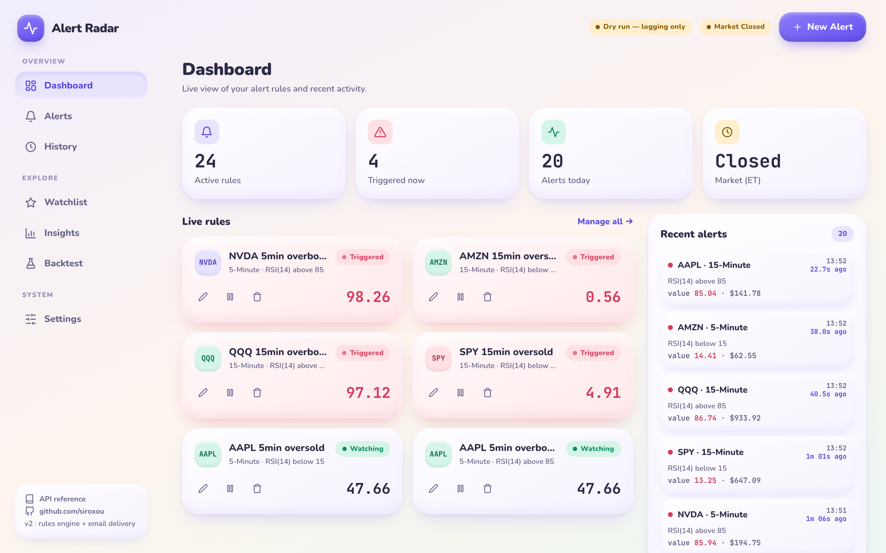
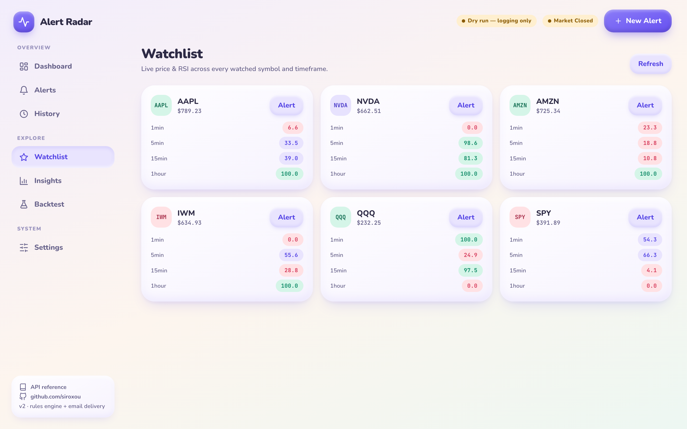
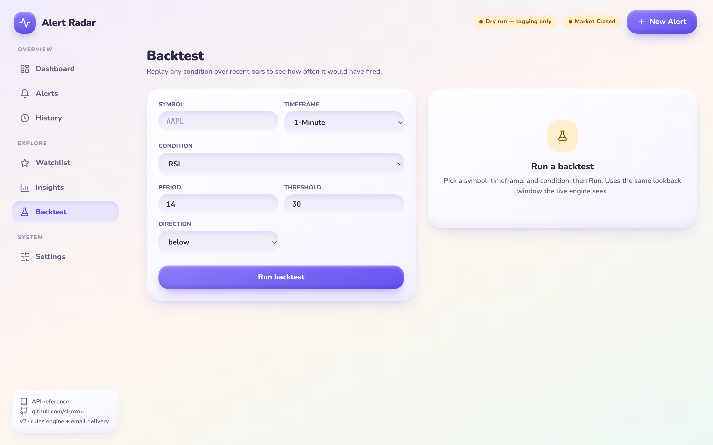
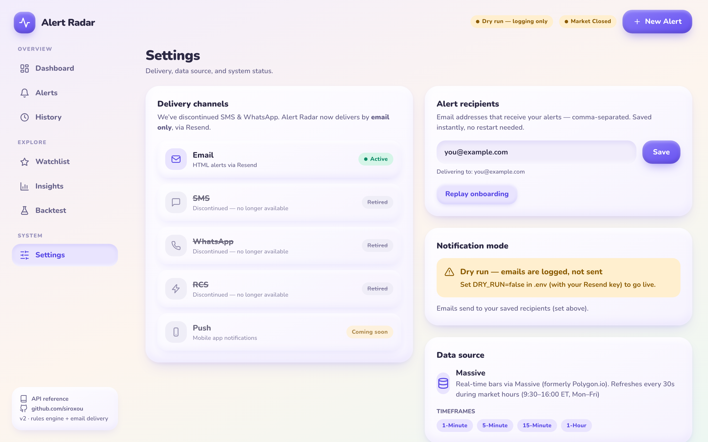
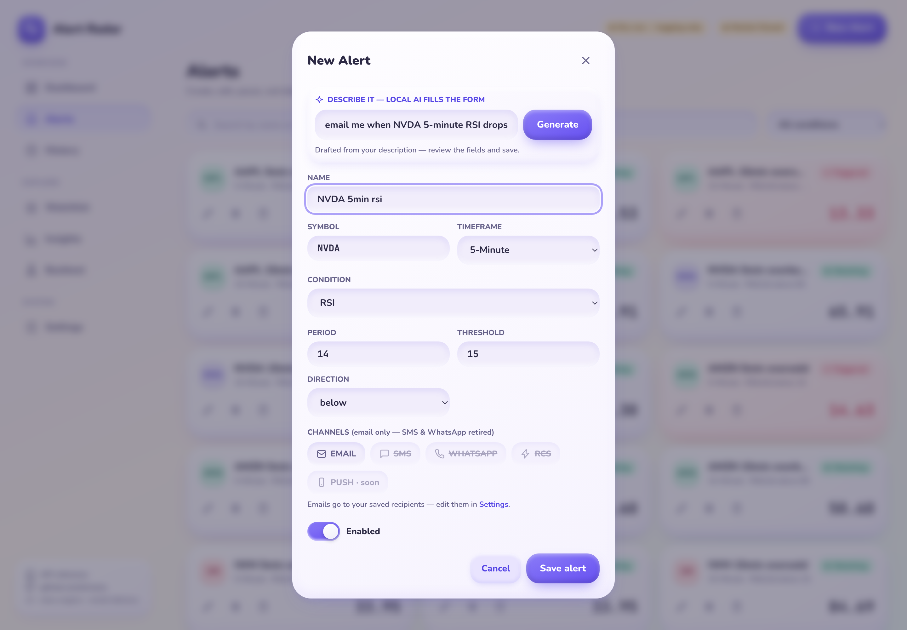
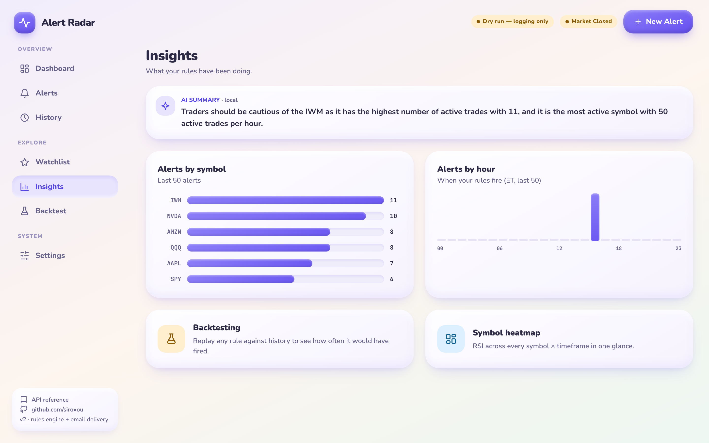
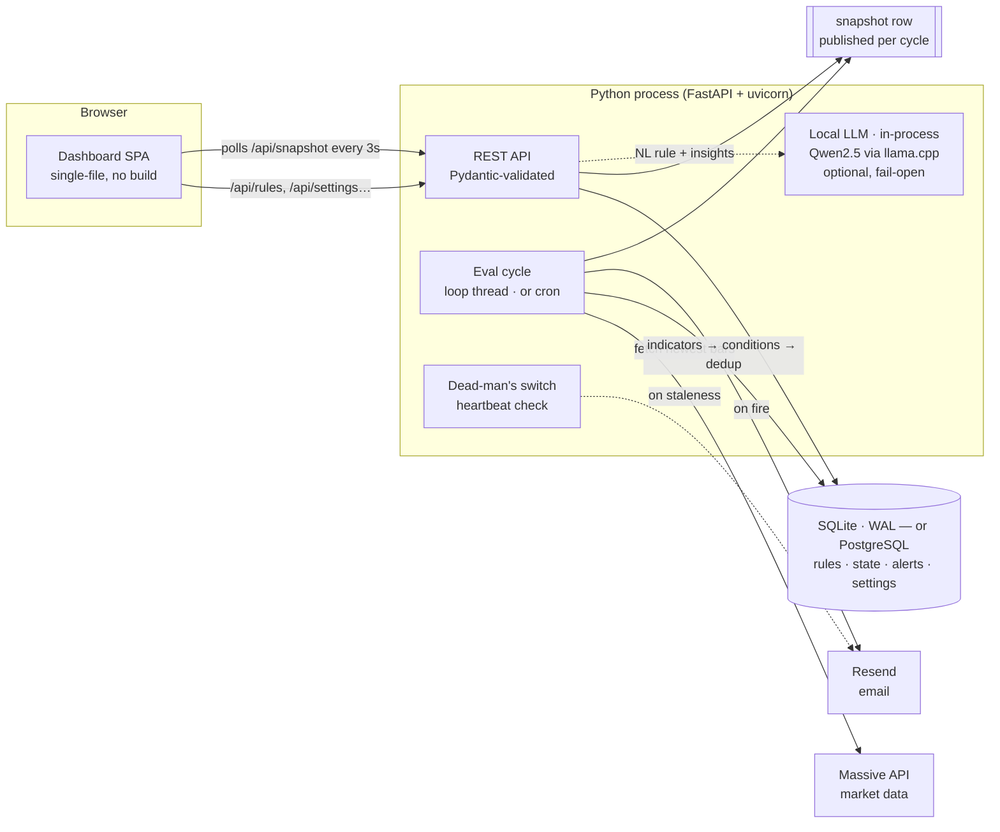
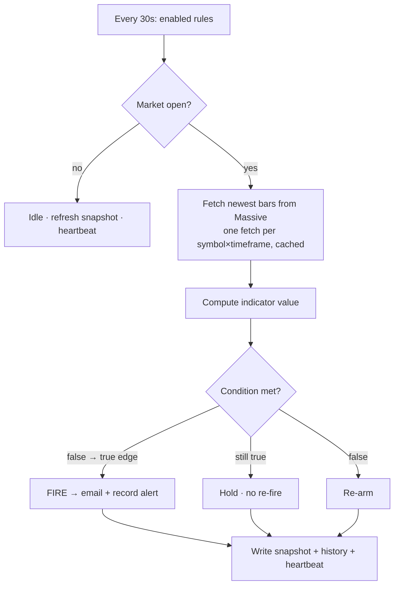

<div align="center">

# 📡 Alert Radar

### A customizable, real-time market-alert engine for stocks & ETFs — with a live dashboard and instant email delivery.


Define your own rules — *"email me when NVDA's 5-minute RSI drops below 15"* — and Alert Radar watches the market and notifies you the moment a condition fires. No spam, no polling by hand, no spreadsheets.

</div>

---

## Table of contents

- [Why I built this](#why-i-built-this)
- [Screenshots](#screenshots)
- [Features](#features)
- [Architecture](#architecture)
- [How an alert fires](#how-an-alert-fires)
- [Engineering highlights](#engineering-highlights)
- [Tech stack](#tech-stack)
- [Getting started](#getting-started)
- [Configuration](#configuration)
- [Local AI](#local-ai-optional)
- [API reference](#api-reference)
- [Testing](#testing)
- [Performance](#performance)
- [Deployment](#deployment)
- [Project structure](#project-structure)
- [Roadmap](#roadmap)
- [License](#license)

---

## Why I built this

Retail traders juggle a dozen browser tabs watching indicators that only matter for a few seconds a day. Commercial alerting tools are either rigid (fixed indicators) or locked behind subscriptions. I wanted a **self-hostable, fully customizable** alerting engine where the *condition types themselves are extensible* — closer to how Robinhood's alerts feel, but where I own the rules, the data source, and the delivery.

The result is a single Python process that runs a monitoring loop, persists everything to SQLite, and serves a polished single-page dashboard — plus a from-scratch technical-indicator library, an extensible condition registry, a transition-based de-duplication state machine, and a dead-man's switch that emails me if the monitor itself goes down.

## Screenshots

<div align="center">

**Dashboard** — live rule status, triggered-now counts, and a real-time alert feed


**Watchlist** — price + RSI across every symbol × timeframe at a glance


**Backtest** — replay any condition over recent bars to see how often it would have fired


**Settings** — editable recipients, delivery status, and data-source config


**Local AI — rule builder** — describe an alert in plain English; an in-process model drafts and pre-fills the whole rule (grammar-constrained, then validated)


**Local AI — insights summary** — a natural-language read on your recent firing patterns


</div>

## Features

- **Customizable, extensible rules** — RSI, RSI band (fires on either bound), price levels, percent change, and moving-average crosses. New condition types are a ~15-line class away thanks to a decorator-based registry.
- **Instant email delivery** via [Resend](https://resend.com) — clean HTML alerts sent from your own verified domain.
- **Live dashboard** — create / edit / pause / delete rules, watch live indicator values, and see a *"triggered X ago"* counter tick in real time on every alert.
- **Watchlist** — live price and RSI for every watched symbol across all timeframes, color-coded oversold/overbought.
- **Backtesting** — replay any condition over the recent lookback window and get fire count, fire rate, and the exact bars where it triggered.
- **Local AI (optional)** — describe an alert in plain English and an *in-process* model (Qwen2.5, no cloud or API keys) drafts the rule; plus an AI narrative of your firing patterns on the Insights page. Runs on your machine, fully offline, and fails open.
- **Dead-man's switch** — if the evaluation loop stops completing healthy cycles, you get an email *and* the dashboard shows a "Monitor stalled" badge. You find out when the monitor breaks — not when you miss a trade.
- **Guided onboarding** — a short first-run flow to set your alert email and create a first rule.
- **Dry-run mode** — every notification path can log instead of send, so you can develop and test safely.
- **Zero-spam de-duplication** — an alert fires once when a condition becomes true and re-arms only after it clears.

## Architecture

Alert Radar is one long-lived process: a FastAPI app plus a background evaluation thread, sharing a WAL-mode SQLite database.



**Separation of concerns:**

| Module | Responsibility |
|--------|----------------|
| `config.py` | Environment loading, tunables, `.env` parsing |
| `massive_client.py` | Market-data REST client (newest-bars fetch, retry on 429) |
| `rsi.py` | Pure-Python technical indicators (Wilder RSI, SMA, EMA, %-change) |
| `conditions.py` | Extensible condition registry (`@register`) |
| `db.py` | SQLite persistence — rules, dedup state, alert history, settings |
| `notifier.py` | Resend email rendering + dead-man's-switch alert |
| `engine.py` | Evaluation loop, snapshot writer, watchlist & backtest |
| `ai.py` | Optional in-process LLM (Qwen2.5 via llama.cpp) — NL→rule + insights summary |
| `main.py` | FastAPI app, Pydantic request models, routes, lifespan |
| `index.html` | No-build single-page dashboard |

## How an alert fires



The **false→true edge** logic is the core of the no-spam guarantee: a rule crossing its threshold emails you exactly once, then stays quiet until the indicator leaves the trigger zone and comes back.

## Engineering highlights

Things in here I'm happy with — and would happily walk through in an interview:

- **Extensible condition registry (Strategy pattern).** Each condition is a class decorated with `@register("name")` exposing `evaluate() → (fired, value)` and `describe()`. The engine, API validation, and the dashboard's dynamic form are all driven off the same registry, so adding an indicator touches exactly one file and automatically shows up everywhere.
- **Transition-based de-duplication state machine.** Alerts are modeled as edges, not levels: `db.record_transition()` returns `True` only on a fresh false→true transition. Even a "MA cross" is expressed as *"fast is now above slow"*, so the same dedup logic covers every condition type.
- **Dependency-light technical indicators.** Wilder-smoothed RSI, SMA, EMA, and percent-change are implemented from scratch in pure Python — no numpy, no pandas. The whole runtime needs just three packages (`fastapi`, `uvicorn`, `requests`), and the indicators are trivially unit-testable against textbook values.
- **Thread-safe persistence.** The eval-loop thread and the web CRUD handlers share SQLite in WAL mode with a write lock, so reads never block and writes never corrupt.
- **Single-row snapshot.** Each cycle publishes its view as one row in the database and the dashboard polls it, so a reader never sees a half-written state and a cold serverless process can still answer.
- **Dead-man's switch.** A heartbeat timestamp is refreshed on every healthy cycle; if it goes stale the process emails an ops warning and the UI flips to a "Monitor stalled" state. Silent failure is the worst failure mode for an alerting system, so this is designed in.
- **Validated trust boundary.** Untrusted rule payloads are validated by Pydantic models at the HTTP edge (unknown condition types, bad timeframes, malformed symbols, and unrecognised fields are rejected with `422`) before anything reaches the engine.
- **Authenticated.** One shared token gates the dashboard and the API. The browser trades it for an `httpOnly` cookie; API clients send `Authorization: Bearer …`. A deployed instance refuses to serve at all without one.
- **No-build frontend.** The dashboard is a single hand-written HTML file — Tailwind via CDN, inline SVG icons, a hash router, and a 3-second snapshot poll. Claymorphism design, fully responsive, accessible (skip links, ARIA labels, reduced-motion support), zero npm toolchain.
- **Optional local LLM, in-process.** A quantized Qwen2.5 model (`llama-cpp-python`) turns plain-English requests into rules with **grammar-constrained decoding** (guaranteed-valid JSON, then validated by the same registry) and narrates the Insights page — no cloud, no API keys, and fully fail-open so the app runs unchanged without it.

## Tech stack

| Layer | Choice | Why |
|-------|--------|-----|
| Language | **Python 3.11+** | Batteries-included stdlib; great for a small, dependency-light service |
| Web / API | **FastAPI + uvicorn** | Async, auto-generated OpenAPI docs, Pydantic validation for free |
| Persistence | **SQLite (WAL mode)** | Zero-ops durability; safe cross-thread concurrency |
| Market data | **Massive** (formerly Polygon.io) | Real-time OHLC aggregates |
| Email | **Resend** | Simple REST API, domain verification, great deliverability |
| Frontend | **Vanilla JS + Tailwind (CDN)** | No build step; a single deployable HTML file |
| Local AI | **Qwen2.5 (GGUF) + llama.cpp** | In-process, offline, grammar-constrained JSON — no cloud, no keys |
| Tests | **stdlib `assert`** | One dependency-free suite, no framework needed |

## Getting started

```bash
git clone https://github.com/siroxou/alert-radar.git
cd alert-radar
pip install -r requirements.txt

# Try it instantly with synthetic data — no API keys required:
python main.py --demo
```

Then open **http://localhost:8000**. Demo mode drives the whole pipeline (rules, alerts, watchlist, backtest) off a synthetic random-walk generator so you can explore everything offline.

For live monitoring:

```bash
cp .env.example .env     # add your Massive + Resend keys, set DRY_RUN=false
python main.py
```

## Configuration

All configuration is via environment variables (loaded from `.env`):

| Variable | Description | Default |
|----------|-------------|---------|
| `MASSIVE_API_KEY` | Massive API key (real-time market data) | — |
| `MASSIVE_BASE_URL` | Override the Massive API base URL | `https://api.massive.com` |
| `RESEND_API_KEY` | Resend API key | — |
| `EMAIL_FROM` | Sender address (must be on a Resend-verified domain) | `Alert Radar <alerts@…>` |
| `DEFAULT_EMAIL_RECIPIENTS` | Fallback recipients, comma-separated (also editable in the UI) | — |
| `DRY_RUN` | Log notifications instead of sending | `true` |
| `DASHBOARD_PORT` | Web dashboard port | `8000` |
| `REFRESH_SECONDS` | Evaluation interval | `30` |
| `DEADMAN_SECONDS` | Dead-man's-switch staleness window | `max(300, refresh×6)` |
| `AI_ENABLED` | Enable the local NL rule builder + insights summary | `true` |
| `AI_MODEL_REPO` / `AI_MODEL_FILE` | Hugging Face GGUF repo + file (swap to the 0.5B variant for low-RAM) | Qwen2.5-1.5B GGUF |

> Recipients resolve in priority order: **saved Settings → `.env` default**, so you can change where alerts go from the dashboard without a restart. If the database is unreachable the `.env` default is used, so a "monitor is down" warning still reaches you.

## Local AI (optional)

Two features run a small language model **in-process** — no cloud, no API keys, no separate server:

- **Natural-language rule builder** — in the New Alert dialog, type *"email me when NVDA's 5-minute RSI drops below 15"* and the model drafts a structured rule. Output is **grammar-constrained JSON**, then validated by the same `conditions.validate()` the manual form uses, and pre-fills the form for you to review and save.
- **Insights summary** — a 1–2 sentence natural-language read on your recent firing patterns at the top of the Insights page (cached until a new alert fires).

**Model:** [Qwen2.5-1.5B-Instruct](https://huggingface.co/Qwen/Qwen2.5-1.5B-Instruct-GGUF) (Apache-2.0, GGUF) via [`llama-cpp-python`](https://github.com/abetlen/llama-cpp-python). It's **auto-downloaded** to `models/` on first use (~1.1 GB), then runs fully offline on CPU. Set `AI_MODEL_REPO`/`AI_MODEL_FILE` to the [0.5B variant](https://huggingface.co/Qwen/Qwen2.5-0.5B-Instruct-GGUF) for low-RAM machines.

Everything **fails open**: if `llama-cpp-python` isn't installed or the download fails, the app runs exactly as it does without AI and the AI controls simply hide. Toggle with `AI_ENABLED`.

## API reference

Interactive OpenAPI docs are served at `/docs`.

| Method | Path | Purpose |
|--------|------|---------|
| `GET` | `/api/meta` | Symbols, timeframes, condition schema, feature flags |
| `GET` | `/api/snapshot` | Live rule status, recent alerts, and health |
| `GET` `POST` | `/api/rules` | List / create rules |
| `PUT` `DELETE` | `/api/rules/{id}` | Update / delete a rule |
| `GET` | `/api/alerts` | Alert history |
| `GET` `PUT` | `/api/settings` | Read / set alert recipients |
| `GET` | `/api/watchlist` | Price + RSI grid across symbols × timeframes |
| `POST` | `/api/backtest` | Replay a condition over recent bars |
| `POST` | `/api/ai/parse-rule` | Plain English → validated rule draft (local model) |
| `GET` | `/api/ai/insights-summary` | Local-AI narrative of recent firing patterns |

## Testing

```bash
python test_all.py
```

A single, framework-free, network-free suite (temp SQLite + synthetic series) covering config, indicators, the condition registry + validation, the NYSE calendar (asserted against the published 2026/2027 dates), CRUD, the dedup state machine, batched notification, a full engine cycle, recipient resolution, backtest/watchlist, the HTTP routes (auth gate, payload validation, cron secret), and the local-AI parse/summary (stubbed — no model or network). **11/11 passing.**

## Performance

**Local AI** — measured in-process on CPU with the model warm (cached). A 6-prompt suite spanning every condition type (RSI, RSI-band, price, %-change, MA-cross); each generation is grammar-constrained and re-validated by `conditions.validate()`:

| Model | First-run download | Load (mmap, cached) | Rule parse — median (range) | Insights summary | Accuracy |
|-------|--------------------|---------------------|-----------------------------|------------------|----------|
| **Qwen2.5-1.5B** (default) | ~1.1 GB, one-time | 0.7s | **0.71s** (0.59–1.76s) | 0.6s | **6/6** |
| Qwen2.5-0.5B (low-RAM) | ~0.4 GB, one-time | 0.2s | **0.55s** (0.44–1.79s) | 0.3s | **6/6** |

The GGUF is memory-mapped and the model stays resident after the first request, so steady-state parses are **sub-second on CPU**. The only slow step is the one-time model download on first use — everything after runs fully offline. The 1.5B is the default for best disambiguation (e.g. it maps *"hits either 20 or 80"* to `rsi_band` where the 0.5B falls back to plain `rsi`); the 0.5B trades a little quality for ~half the size and latency. *(Numbers depend on hardware; measured on an Apple-silicon laptop.)*

**Alert engine** — each cycle fetches every `(symbol, timeframe)` once (cached), runs pure-Python indicators, dedups via the database state machine, and publishes a snapshot row; the dashboard polls it every 3s. A cycle's fired rules are emailed in **one batched request**, so a correlated move does not turn into N round-trips against Resend's rate limit. Rules are evaluated every `REFRESH_SECONDS` (default 30s) during market hours — no per-request market-data calls, so the UI stays instant regardless of rule count.

## Deployment

The app runs in two shapes from one codebase.

### Always-on host — Docker, systemd, a VPS

A single resident process serves the dashboard and runs the evaluation loop every `REFRESH_SECONDS`, persisting to SQLite on local disk.

```bash
docker compose up -d      # loads .env, persists SQLite in ./data/
```

**Linux VPS (systemd):** a ready-to-adapt unit lives in [`deploy/rsi-alerts.service`](deploy/rsi-alerts.service) (`Restart=always`, `EnvironmentFile`, `After=network.target`).

**Windows:** run `python main.py` under Task Scheduler or NSSM.

### Serverless — Vercel

Vercel has a read-only filesystem, no resident process, and a fresh process per request, so three things change automatically when `VERCEL` is set:

| Always-on | On Vercel |
|---|---|
| Background thread every 30s | Vercel Cron → `GET /api/cron/evaluate` |
| SQLite file on disk | PostgreSQL via `DATABASE_URL` |
| `snapshot.json` + `alerts.log` on disk | Snapshot row in the database; logs to stdout |
| Local Qwen2.5 via llama.cpp | Unavailable — the AI panels hide themselves |

Required environment variables:

| Variable | Why |
|---|---|
| `DATABASE_URL` | Any PostgreSQL (Supabase, Neon, RDS). Without it there is nowhere for rules to live. |
| `ALERT_RADAR_TOKEN` | Dashboard/API password. **The app returns `503` until this is set** — an open `/api/settings` would let anyone redirect your alerts to their own address and send mail from your verified domain. |
| `CRON_SECRET` | A *different* secret. Vercel sends it to the cron endpoint; keeping it separate stops a dashboard user forcing evaluation cycles. |
| `MASSIVE_API_KEY`, `RESEND_API_KEY`, `DRY_RUN=false` | Market data and delivery. |

```bash
vercel deploy --prod
```

#### Driving the evaluation cycle for free

Vercel's Hobby plan caps cron at **once per day**, which cannot drive an alerting system — and a more frequent expression in `vercel.json` fails the deployment outright. So `vercel.json` ships **no cron at all**. `GET /api/cron/evaluate` accepts any caller holding `CRON_SECRET`, which means the scheduler can live anywhere:

| Trigger | Cadence | Cost | Notes |
|---|---|---|---|
| **External pinger** (cron-job.org, Cloudflare Worker Cron) | **1 min** | Free | Most reliable free option. Send `Authorization: Bearer $CRON_SECRET`. |
| **GitHub Actions** (`.github/workflows/evaluate.yml`, included) | 5 min, best-effort | Free | Zero signup, but GitHub delays scheduled runs at peak and disables them after 60 days of repo inactivity. |
| **Vercel Cron** | 1 min | Pro plan | Add a `crons` entry back to `vercel.json`. |
| **Always-on Docker/systemd** | 30 s | Free on your own box | The original path — still the most responsive. |

For the included workflow, set two repository secrets: `ALERT_RADAR_URL` (your deployment URL) and `CRON_SECRET` (matching the Vercel env var).

> A cron-driven dead-man's switch cannot detect its *own* trigger failing, so `healthy` is computed when the snapshot is **read**, not when it is written — a stalled scheduler shows up the moment anyone opens the dashboard. For real coverage, also point an external uptime monitor at the deployment.

> **Use a pooled connection string.** Every request is a fresh process, so `DATABASE_URL` should point at a transaction pooler (Supabase/Supavisor port `6543`) rather than the direct `5432` port, or connections exhaust quickly.

## Project structure

```
alert-radar/
├── main.py              # FastAPI app, routes, request validation, lifespan
├── engine.py            # eval loop, dead-man's switch, watchlist, backtest
├── ai.py                # optional local LLM (Qwen2.5 via llama.cpp) — NL rules + insights
├── conditions.py        # extensible condition registry
├── rsi.py               # pure-Python indicators (RSI, SMA, EMA, %-change)
├── db.py                # persistence — SQLite (local) or PostgreSQL (serverless)
├── notifier.py          # batched Resend email + dead-man's-switch alert
├── massive_client.py    # market-data REST client
├── config.py            # env + settings
├── index.html           # single-file dashboard SPA
├── test_all.py          # dependency-free test suite (11/11)
├── vercel.json          # cron schedule + function config
├── Dockerfile · docker-compose.yml · deploy/rsi-alerts.service
└── .env.example
```

## Roadmap

- Christmas-Eve half-day when Dec 24 is itself the observed holiday (rare; currently treated as a full session)
- Compiled Tailwind build for production (drops the CDN `<script>` and lets a strict CSP land)
- Per-rule cooldown / re-arm intervals
- Web-push and webhook delivery channels

## License

[MIT](LICENSE) — © Siroxou

<div align="center">

**Built by [Siroxou](https://github.com/siroxou)** · [Report an issue](https://github.com/siroxou/alert-radar/issues)

</div>
